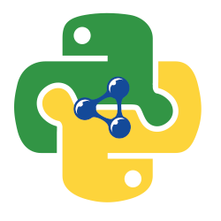

# pySHACL
A Python validator for SHACL.

[](https://drone.rdflib.ashs.dev/RDFLib/pySHACL)

[](https://zenodo.org/badge/latestdoi/147505799) [](https://pepy.tech/project/pyshacl) [](https://pepy.tech/project/pyshacl/month) [](https://pepy.tech/project/pyshacl/week)

This is a pure Python module which allows for the validation of [RDF](https://www.w3.org/2001/sw/wiki/RDF) graphs against Shapes Constraint Language ([SHACL](https://www.w3.org/TR/shacl/)) graphs. This module uses the [rdflib](https://github.com/RDFLib/rdflib) Python library for working with RDF and is dependent on the [OWL-RL](https://github.com/RDFLib/OWL-RL) Python module for [OWL2 RL Profile](https://www.w3.org/TR/owl2-overview/#ref-owl-2-profiles) based expansion of data graphs.

This module is developed to adhere to the SHACL Recommendation:
> Holger Knublauch; Dimitris Kontokostas. *Shapes Constraint Language (SHACL)*. 20 July 2017. W3C Recommendation. URL: <https://www.w3.org/TR/shacl/> ED: <https://w3c.github.io/data-shapes/shacl/>

# Community for Help and Support
The SHACL community has a discord server for discussion of topics around SHACL and the SHACL specification.

[Use this invitation link: https://discord.gg/RTbGfJqdKB to join the server](https://discord.gg/RTbGfJqdKB)

There is a \#pyshacl channel for discussion of this python library, and you can ask for general SHACL help too.

## Installation
Install with PIP (Using the Python3 pip installer `pip3`)
```bash
$ pip3 install pyshacl
```

Or in a python virtualenv _(these example commandline instructions are for a Linux/Unix based OS)_
```bash
$ python3 -m virtualenv --python=python3 --no-site-packages .venv
$ source ./.venv/bin/activate
$ pip3 install pyshacl
```

To exit the virtual enviornment:
```bash
$ deactivate
```

## Command Line Use
For command line use:
_(these example commandline instructions are for a Linux/Unix based OS)_
```bash
$ pyshacl -s /path/to/shapesGraph.ttl -m -i rdfs -a -j -f human /path/to/dataGraph.ttl
```
Where
 - `-s` is an (optional) path to the shapes graph to use
 - `-e` is an (optional) path to an extra ontology graph to import
 - `-i` is the pre-inferencing option
 - `-f` is the ValidationReport output format (`human` = human-readable validation report)
 - `-m` enable the meta-shacl feature
 - `-a` enable SHACL Advanced Features
 - `-j` enable SHACL-JS Features (if `pyhsacl[js]` is installed)

System exit codes are:
`0` = DataGraph is Conformant
`1` = DataGraph is Non-Conformant
`2` = The validator encountered a RuntimeError (check stderr output for details)
`3` = Not-Implemented; The validator encountered a SHACL feature that is not yet implemented.

Full CLI Usage options:
```bash
$ pyshacl -h
$ python3 -m pyshacl -h
usage: pyshacl [-h] [-s [SHACL]] [-e [ONT]] [-i {none,rdfs,owlrl,both}] [-m]
               [-im] [-a] [-j] [-it] [--abort] [--allow-info] [-w] [-d]
               [-f {human,table,turtle,xml,json-ld,nt,n3}]
               [-df {auto,turtle,xml,json-ld,nt,n3}]
               [-sf {auto,turtle,xml,json-ld,nt,n3}]
               [-ef {auto,turtle,xml,json-ld,nt,n3}] [-V] [-o [OUTPUT]]
               DataGraph

PySHACL 0.25.0 command line tool.

positional arguments:
  DataGraph             The file containing the Target Data Graph.

optional arguments:
  --server              Ignore all the rest of the options, start the HTTP Server.
  -h, --help            show this help message and exit
  -s [SHACL], --shacl [SHACL]
                        A file containing the SHACL Shapes Graph.
  -e [ONT], --ont-graph [ONT]
                        A file path or URL to a document containing extra
                        ontological information. RDFS and OWL definitions from this 
                        are used to inoculate the DataGraph.
  -i {none,rdfs,owlrl,both}, --inference {none,rdfs,owlrl,both}
                        Choose a type of inferencing to run against the Data
                        Graph before validating.
  -m, --metashacl       Validate the SHACL Shapes graph against the shacl-
                        shacl Shapes Graph before validating the Data Graph.
  -im, --imports        Allow import of sub-graphs defined in statements with
                        owl:imports.
  -a, --advanced        Enable features from the SHACL Advanced Features
                        specification.
  -j, --js              Enable features from the SHACL-JS Specification.
  -it, --iterate-rules  Run Shape's SHACL Rules iteratively until the
                        data_graph reaches a steady state.
  --abort               Abort on first invalid data.
  --allow-info, --allow-infos
                        Shapes marked with severity of Info will not cause
                        result to be invalid.
  -w, --allow-warning, --allow-warnings
                        Shapes marked with severity of Warning or Info will
                        not cause result to be invalid.
  -d, --debug           Output additional runtime messages.
  -f {human,table,turtle,xml,json-ld,nt,n3}, --format {human,table,turtle,xml,json-ld,nt,n3}
                        Choose an output format. Default is "human".
  -df {auto,turtle,xml,json-ld,nt,n3}, --data-file-format {auto,turtle,xml,json-ld,nt,n3}
                        Explicitly state the RDF File format of the input
                        DataGraph file. Default="auto".
  -sf {auto,turtle,xml,json-ld,nt,n3}, --shacl-file-format {auto,turtle,xml,json-ld,nt,n3}
                        Explicitly state the RDF File format of the input
                        SHACL file. Default="auto".
  -ef {auto,turtle,xml,json-ld,nt,n3}, --ont-file-format {auto,turtle,xml,json-ld,nt,n3}
                        Explicitly state the RDF File format of the extra
                        ontology file. Default="auto".
  -V, --version         Show PySHACL version and exit.
  -o [OUTPUT], --output [OUTPUT]
                        Send output to a file (defaults to stdout).
```

## Python Module Use
For basic use of this module, you can just call the `validate` function of the `pyshacl` module like this:

```python
from pyshacl import validate
r = validate(data_graph,
      shacl_graph=sg,
      ont_graph=og,
      inference='rdfs',
      abort_on_first=False,
      allow_infos=False,
      allow_warnings=False,
      meta_shacl=False,
      advanced=False,
      js=False,
      debug=False)
conforms, results_graph, results_text = r
```

Where:
* `data_graph` is an rdflib `Graph` object or file path of the graph to be validated
* `shacl_graph` is an rdflib `Graph` object or file path or Web URL of the graph containing the SHACL shapes to validate with, or None if the SHACL shapes are included in the data_graph.
* `ont_graph` is an rdflib `Graph` object or file path or Web URL a graph containing extra ontological information, or None if not required. RDFS and OWL definitions from this are used to inoculate the DataGraph.
* `inference` is a Python string value to indicate whether or not to perform OWL inferencing expansion of the `data_graph` before validation.
Options are 'rdfs', 'owlrl', 'both', or 'none'. The default is 'none'.
* `abort_on_first` (optional) `bool` value to indicate whether or not the program should abort after encountering the first validation failure or to continue. Default is to continue.
* `allow_infos` (optional) `bool` value, Shapes marked with severity of Info will not cause result to be invalid.
* `allow_warnings` (optional) `bool` value, Shapes marked with severity of Warning or Info will not cause result to be invalid.
* `meta_shacl` (optional) `bool` value to indicate whether or not the program should enable the Meta-SHACL feature. Default is False.
* `advanced`: (optional) `bool` value to enable SHACL Advanced Features
* `js`: (optional) `bool` value to enable SHACL-JS Features (if `pyshacl[js]` is installed)
* `debug` (optional) `bool` value to indicate whether or not the program should emit debugging output text, including violations that didn't lead to non-conformance overall. So when debug is True don't judge conformance by absense of violation messages. Default is False.

Some other optional keyword variables available on the `validate` function:
* `data_graph_format`: Override the format detection for the given data graph source file.
* `shacl_graph_format`: Override the format detection for the given shacl graph source file.
* `ont_graph_format`: Override the format detection for the given extra ontology graph source file.
* `iterate_rules`: Iterate SHACL Rules until steady state is found (only works with advanced mode).
* `do_owl_imports`: Enable the feature to allow the import of subgraphs using `owl:imports` for the shapes graph and the ontology graph. Note, you explicitly cannot use this on the target data graph.
* `serialize_report_graph`: Convert the report results_graph into a serialised representation (for example, 'turtle')
* `check_dash_result`: Check the validation result against the given expected DASH test suite result.
* `check_sht_result`: Check the validation result against the given expected SHT test suite result.

Return value:
* a three-component `tuple` containing:
  * `conforms`: a `bool`, indicating whether or not the `data_graph` conforms to the `shacl_graph`
  * `results_graph`: a `Graph` object built according to the SHACL specification's [Validation Report](https://www.w3.org/TR/shacl/#validation-report) structure
  * `results_text`: python string representing a verbose textual representation of the [Validation Report](https://www.w3.org/TR/shacl/#validation-report)


## Python Module Call

You can get an equivalent of the Command Line Tool using the Python3 executable by doing:

```bash
$ python3 -m pyshacl
```

## Integrated OpenAPI-3.0-compatible HTTP REST Service

PySHACL now has a built-in validation service, exposed via an OpenAPI3.0-compatible REST API.

Due to the additional dependencies required to run, this feature is an optional extra.

You must first install PySHACL with the `http` extra option enabled:

```bash
$ pip3 install -U pyshacl[http]
```

When that is installed, you can start the service using the by executing the CLI entrypoint:

```bash
$ pyshacl --server
# or
$ pyshacl_server
# or
$ python3 -m pyshacl server
# or
$ docker run --rm -e PYSHACL_SERVER=TRUE -i -t docker.io/ashleysommer/pyshacl:latest
```

By default, this will run the service on localhost address `127.0.0.1` on port `8099`.

To view the SwaggerUI documentation for the service, navigate to `http://127.0.0.1:8099/docs/swagger` and for the ReDoc version, go to `http://127.0.0.1:8099/docs/redoc`.

To view the OpenAPI3 schema see `http://127.0.0.1:8099/docs/openapi.json`

### Configuring the HTTP REST Service

- You can force PySHACL CLI to start up in HTTP Server mode by passing environment variable `PYSHACL_SERVER=TRUE`. This is useful in a containerised service, where you will _only_ be running PySHACL in this mode.
- `PYSHACL_SERVER_LISTEN=1.2.3.4` listen on a different IP Address or hostname
- `PYSHACL_SERVER_PORT=8080` listen on given different TCP PORT
- `PYSHACL_SERVER_HOSTNAME=example.org` when you are hosting the server behind a reverse-proxy or in a containerised environment, use this so PySHACL server knows what your externally facing hostname is


## Errors
Under certain circumstances pySHACL can produce a `Validation Failure`. This is a formal error defined by the SHACL specification and is required to be produced as a result of specific conditions within the SHACL graph.
If the validator produces a `Validation Failure`, the `results_graph` variable returned by the `validate()` function will be an instance of `ValidationFailure`.
See the `message` attribute on that instance to get more information about the validation failure.

Other errors the validator can generate:
- `ShapeLoadError`: This error is thrown when a SHACL Shape in the SHACL graph is in an invalid state and cannot be loaded into the validation engine.
- `ConstraintLoadError`: This error is thrown when a SHACL Constraint Component is in an invalid state and cannot be loaded into the validation engine.
- `ReportableRuntimeError`: An error occurred for a different reason, and the reason should be communicated back to the user of the validator.
- `RuntimeError`: The validator encountered a situation that caused it to throw an error, but the reason does concern the user.

Unlike `ValidationFailure`, these errors are not passed back as a result by the `validate()` function, but thrown as exceptions by the validation engine and must be
caught in a `try ... except` block.
In the case of `ShapeLoadError` and `ConstraintLoadError`, see the `str()` string representation of the exception instance for the error message along with a link to the relevant section in the SHACL spec document.


## Windows CLI

[Pyinstaller](https://www.pyinstaller.org/) can be
[used](https://pyinstaller.readthedocs.io/en/stable/usage.html) to create an
executable for Windows that has the same characteristics as the Linux/Mac
CLI program.
The necessary ``.spec`` file is already included in ``pyshacl/pyshacl-cli.spec``.
The ``pyshacl-cli.spec`` PyInstaller spec file creates a ``.exe`` for the
pySHACL Command Line utility. See above for the pySHACL command line util usage instructions.

See [the PyInstaller installation guide](https://pyinstaller.readthedocs.io/en/stable/installation.html#installing-in-windows) for info on how to install PyInstaller for Windows.

Once you have pyinstaller, use pyinstaller to generate the ``pyshacl.exe`` CLI file like so:
```bash powershell
$ cd src/pyshacl
$ pyinstaller pyshacl-cli.spec
```
This will output ``pyshacl.exe`` in the ``dist`` directory in ``src/pyshacl``.

You can now run the pySHACL Command Line utility via ``pyshacl.exe``.
See above for the pySHACL command line util usage instructions.

## Docker
Pull out the official docker image from Dockerhub:
`docker pull docker.io/ashleysommer/pyshacl:latest`

Or build the image yourself, from the PySHACL repository with `docker build . -t pyshacl`.

You can now run PySHACL inside a container; but you need to mount the data you want to validate.
For example, to validate `graph.ttl` against `shacl.ttl`, run :
```bash
docker run --rm -i -t --mount type=bind,src=`pwd`,dst=/data pyshacl -s /data/shacl.ttl /data/graph.ttl
```

## Compatibility
PySHACL is a Python3 library. For best compatibility use Python v3.7 or greater. Python3 v3.6 or below is _**not supported**_ and this library _**does not work**_ on Python v2.7.x or below.

PySHACL is now a PEP518 & PEP517 project, it uses `pyproject.toml` and `poetry` to manage dependencies, build and install.

For best compatibility when installing from PyPI with `pip`, upgrade to pip v18.1.0 or above.
  - If you're on Ubuntu 16.04 or 18.04, you will need to run `sudo pip3 install --upgrade pip` to get the newer version.


## Features
A features matrix is kept in the [FEATURES file](https://github.com/RDFLib/pySHACL/blob/master/FEATURES.md).


## Changelog
A comprehensive changelog is kept in the [CHANGELOG file](https://github.com/RDFLib/pySHACL/blob/master/CHANGELOG.md).


## Benchmarks
This project includes a script to measure the difference in performance of validating the same source graph that has been inferenced using each of the four different inferencing options. Run it on your computer to see how fast the validator operates for you.


## License
This repository is licensed under Apache License, Version 2.0. See the [LICENSE deed](https://github.com/RDFLib/pySHACL/blob/master/LICENSE.txt) for details.


## Contributors
See the [CONTRIBUTORS file](https://github.com/RDFLib/pySHACL/blob/master/CONTRIBUTORS.md).


## Citation
DOI: [10.5281/zenodo.4750840](https://doi.org/10.5281/zenodo.4750840) (For all versions/latest version)

## Contacts
Project Lead:
**Nicholas Car**
*Senior Experimental Scientist*
CSIRO Land & Water, Environmental Informatics Group
Brisbane, Qld, Australia
<nicholas.car@csiro.au>
<http://orcid.org/0000-0002-8742-7730>

Lead Developer:
**Ashley Sommer**
*Informatics Software Engineer*
CSIRO Land & Water, Environmental Informatics Group
Brisbane, Qld, Australia
<Ashley.Sommer@csiro.au>
<https://orcid.org/0000-0003-0590-0131>
